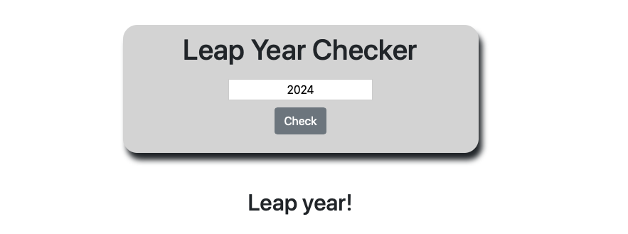

# Leap Year Checker

### Check if any given year is a leap year.
#### _by Micah Olson_

## Description
This application takes a single input from the user and evaluates whether it is a leap year based on divisibility by 4, 100 and 400. Input not in the format of YYYY will prompt the user to correct the input.  

#### Click the image below to interact with the live application.
[](https://micaholson.github.io/leap-year-js)

## Technologies
* HTML
* CSS
* Bootstrap
* JavaScript
* jQuery

## Setup
* Clone this repository locally to your computer.
  ```
  git clone https://github.com/MicahOlson/leap-year.git
  ```

* Navigate into the `leap-year` directory.
  ```
  cd leap-year
  ```

* Open `index.html` in your default browser.
  ```
  open index.html
  ```

## Tests
```
Describe: isLeapYear()  
  
Test: "It returns false for years not divisible by 4"    
Expect(isLeapYear(2022)).toBe(false);  
  
Test: "It returns true for years divisible by 4 but not 100"
Expect(isLeapYear(2024)).toBe(true);  
  
Test: "It returns false for years divisible by 4 and 100, but not 400"  
Expect(isLeapYear(2100)).toBe(false);
```

## Known Bugs
* No known bugs.

## License
[MIT License](LICENSE) - Copyright &#169; 2022 Micah L. Olson

## Contact Information
Contact me by [email](mailto:micah.olson@protonmail.com) or at [LinkedIn](https://www.linkedin.com/in/molson-pdx/).